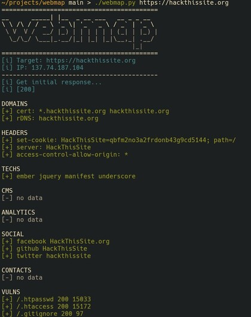

# WebMap

Tool to get information about web application.

Will help developers, pentesters make better safe web apps.



## Usage

```python3 webapp.py https://site.com```

If you want to check vulns by fuzzing (may be abusable, ask about permissions first), add `--fuzz` option:

```python3 webapp.py https://site.com --fuzz```

To ~~hide your ass~~ disable IP resolve, pass `-n`.

To allow redirects pass `-r` option.
